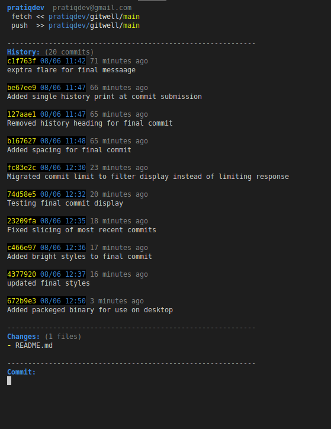

# gitwell

Easy tracking and committing for frequent gitters.



## Installation

### From PyPI *(when published)*

```
pip install gitwell
gitwell --help
```

### From source (recommended for development)

From the repository root with a virtualenv or conda env active:

```
pip install -e ".[build]"
gitwell --help
```

This installs the **`gitwell`** console script. Example:

```
gitwell
```

Or run as a module:

```
python -m gitwell
```

### Prebuilt binaries (GitHub Releases)

Tagged releases attach frozen **`gitwell`** binaries (plus **`SHA256SUMS`**) for common platforms:

1. Open the **Releases** page for this repo.
2. Download **`gitwell-<version>-<os>-<arch>.zip`** matching your OS and CPU.
3. Unzip — you obtain **`gitwell`** (Linux/macOS) or **`gitwell.exe`** (Windows).
4. Verify integrity *before* invoking (example — replace filename):

   ```shell
   sha256sum -c <<<"$(grep ' gitwell-0.1.0-linux-amd64.zip$' SHA256SUMS)"
   ```

   On macOS, `shasum -a256` is common; on Windows see `certutil -hashfile` in tooling docs.

5. Optionally move the binary onto your `PATH` or run it from its folder.

**Trust:** Releases are produced by [.github/workflows/release.yml](.github/workflows/release.yml) on the annotated tag pointing at the promoted commit — compare the Release tag SHA and checksums accordingly. Unsigned binaries may trigger OS security prompts.

### Optional shell alias

If you prefer another command name, make a shell alias pointing at **`gitwell`** or the unpacked binary path (*example:* `alias mygit='~/bin/gitwell'`).

### Packaging from source *(PyInstaller)*

```
pip install -e ".[build]"
pyinstaller --noconfirm --clean gitwell.spec
```

Produces **`dist/gitwell`** (or **`dist/gitwell.exe`** on Windows). Maintainer automation and versioning rules live in [RELEASE.md](RELEASE.md).

## Maintainer releases

See [RELEASE.md](RELEASE.md): tag **`vX.Y.Z`**, CI artifacts, changelog preamble, **`SHA256SUMS`**.

## Full usage

### Entry points

| Invocation | What it runs |
|------------|--------------|
| `gitwell` | Default interactive commit flow (repo summary, staging, history, multi-line commit). |
| `python -m gitwell` | Same as `gitwell`. |

The legacy **`gitwell-config`** shim is unavailable — run **`gitwell config`** instead.

### Commands

| Command | Purpose |
|---------|---------|
| `gitwell help` | Long manual (NAME, SYNOPSIS, COMMANDS, staging rules, FILES, EXAMPLES). |
| `gitwell --help` / `gitwell -h` | Short usage line. |
| `gitwell config …` | Show merged configuration or persist **`.gitwell`** / **`.gitwell_globals`** (**`-g` / `--global`**). Inside this command, **`-h` means `--heading`**, use **`--help`** for CLI help. |
| `gitwell info` · `gitwell i` | Repository banner only *(requires **`.git`**, no staging)*. |
| `gitwell history` · `gitwell h` | Recent commits respecting history knobs *(requires **`.git`**, no staging)*. |

Any first argument without a recognised sub-command continues the **default staging + commit workflow** (matching bare `gitwell`).

### `gitwell config` flags

Accepted forms include **`--opt=value`** **and** **`--opt value`** (ditto shorts), e.g.:

```
gitwell config --auto-stage true
gitwell config -a=true
gitwell config --heading=2
gitwell config -h=2
```

Booleans recognise **`true` / `false`** only (ASCII case-insensitivity). Dedicated **`--no-*`** booleans intentionally do **not** exist.

| Long | Short | YAML key |
|------|-------|----------|
| `--heading` | `-h` | `heading_type` (0–4) |
| `--history-type` | `-y` | `history_type` (0–4) |
| `--diff-type` | `-d` | `diff_type` (0–4) |
| `--commit-type` | `-c` | `commit_type` (0–4) |
| `--final-type` | `-f` | `final_type` (0–4) |
| `--history-length` | `-L` | `history_length` (1–10) |
| `--diff-length` | `-D` | `diff_length` (1–10) |
| `--final-length` | `-N` | `final_length` (1–10) |
| `--stage-command` | `-s` | `stage_command` (*empty / `none` disables*) |
| `--auto-stage` | `-a` | `auto_stage` (`true \| false`) |
| `--global` | `-g` | Write **`~/.gitwell_globals`** instead of `./.gitwell` |

Snippet ideas:

```
gitwell config
gitwell config --heading=2
gitwell config --global --auto-stage=false
gitwell config -s "git add -A"
```

### Staging specifics *(default workflow only)*

- **`stage_command`** defaults to **`git add -A`** and optionally runs ahead of inspecting the staging area.
- **`auto_stage`** **`true`** always applies the command when configured (honouring empty/`none`).
- **`auto_stage`** **`false`** skips **`stage_command`** when there is already staged work compared to **`HEAD`**.
- **`info`/`history`** sub-commands deliberately skip **`stage_command`**.

### Config files on disk

- **`.gitwell_globals`** holds user-global defaults (**auto-created** if absent).
- **`.gitwell`** overrides per repository.

YAML may be tweaked manually anytime.

### `python -m gitwell.config`

This module emits a deprecation notice reminding people to migrate to **`gitwell config`** (the **`gitwell-config`** entry-point is deliberately absent).

