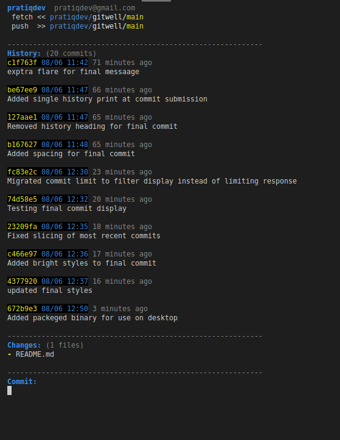

# Git Well (asdf)

Easy tracking and committing for frequent gitters.
 


## Installation

Copy the executable file to a common location:
```
cp asdf_executable /home/utils/asdf_executable
```

Set exec permissions on the new file:
```
chmod +x ~/home/utils/asdf_executable
```

Add an alias in your .bashrc or .zshrc:
```
alias asdf='/home/utils/asdf_executable'
```

Reload your config files:
```
source ~/.zshrc
```

Then run from anywhere:
```
$user:dir:main > asdf
```